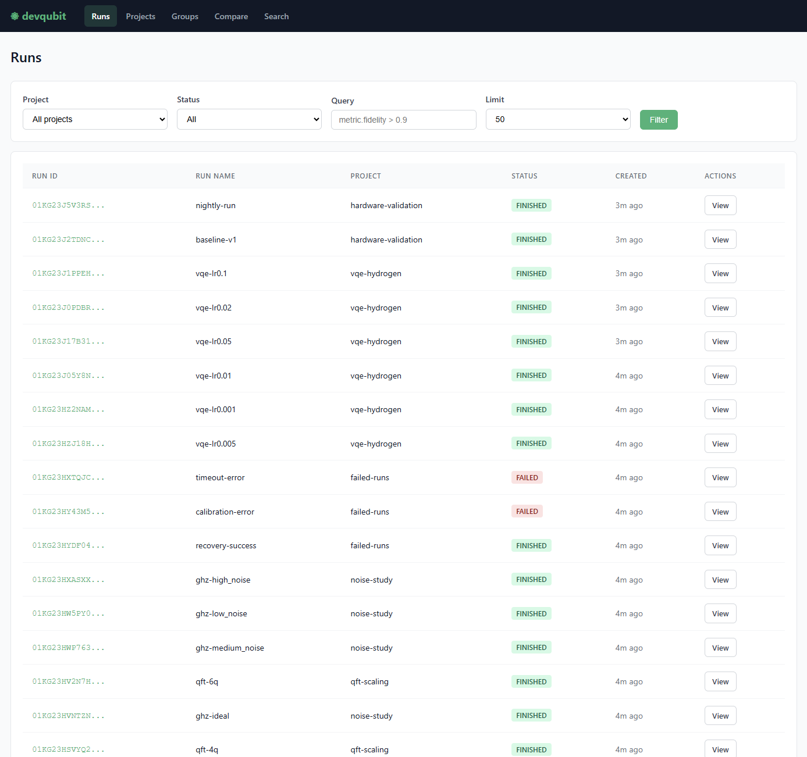
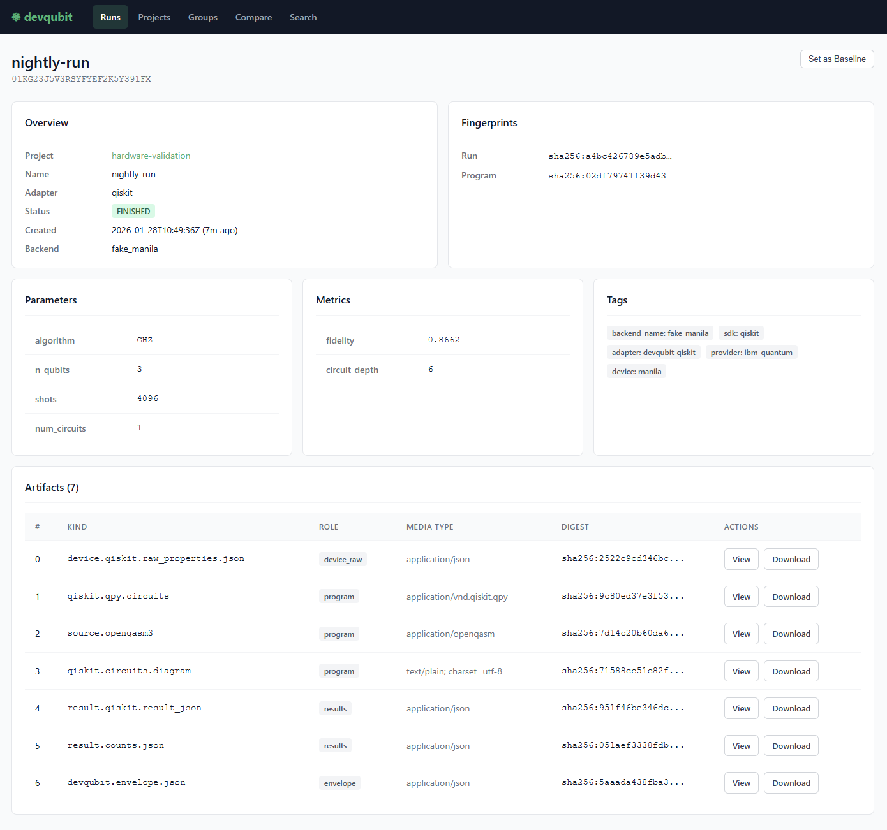

[](https://github.com/devqubit-labs/devqubit/actions/workflows/ci.yaml)
[](https://pypi.org/project/devqubit/)
[](https://pypi.org/project/devqubit/)
[](https://devqubit.readthedocs.io)
[](LICENSE)

# devqubit

**Local-first experiment tracking for quantum computing.**

Capture circuits, backend state, and configuration automatically — runs are reproducible, comparable, and easy to share. Access your data via Python API, CLI, or Web UI.

> [!WARNING]
> **Status:** Alpha — devqubit APIs may evolve in `0.x` releases.
> Users should expect frequent changes that are likely to be incompatible with previously published versions.

## Why devqubit?

General-purpose experiment trackers (MLflow, W&B, neptune.ai) work well for classical ML, but quantum workloads need structure they don't provide out of the box: what actually executed (program + compilation), where it ran (backend/device), and how it ran (runtime options, calibration state).

| Challenge | MLflow / W&B / neptune.ai | devqubit |
|---|---|---|
| **Circuit artifacts** | Manual file logging | OpenQASM 3 + SDK-native formats (automatic) |
| **Device context** | Manual | Backend snapshots, calibration/noise context (automatic) |
| **Reproducibility** | Depends on what you log | Program + device + config fingerprints (automatic) |
| **Result comparison** | Metric/table-oriented | Distribution-aware TVD, structural diff, drift detection |
| **Noise-aware verification** | Requires custom code | Configurable policies with noise tolerance |
| **Portable sharing** | Artifact/version workflows | Self-contained bundles (manifest + SHA-256 digests) |

Same circuit, same backend, different day — different results. devqubit helps you track *why*.

## Features

- **Automatic circuit capture** — QPY, OpenQASM 3, SDK-native formats
- **Multi-SDK support** — Qiskit, Qiskit Runtime, Braket, Cirq, PennyLane, CUDA-Q
- **Content-addressable storage** — deduplicated artifacts with SHA-256 digests
- **Reproducibility fingerprints** — detect changes in program, device, or config
- **Run comparison** — TVD analysis, structural diff, calibration drift detection
- **CI/CD verification** — baselines with configurable noise-aware policies
- **Portable bundles** — export/import runs as self-contained ZIPs
- **Web UI** — browse runs, view artifacts, compare experiments

## Documentation

📚 **<https://devqubit.readthedocs.io>**

## Installation

**Python 3.11+** required.

```bash
pip install devqubit
```

Install with an SDK adapter:

```bash
pip install "devqubit[qiskit]"          # Qiskit + Aer
pip install "devqubit[qiskit-runtime]"  # IBM Quantum Runtime
pip install "devqubit[braket]"          # Amazon Braket
pip install "devqubit[cirq]"            # Google Cirq
pip install "devqubit[pennylane]"       # PennyLane
pip install "devqubit[cudaq]"           # NVIDIA CUDA-Q
pip install "devqubit[all]"             # all adapters
```

Optional extras:

```bash
pip install "devqubit[ui]"              # local web UI
```

## Quick Start

### Track an experiment

```python
from qiskit import QuantumCircuit
from qiskit_aer import AerSimulator
from devqubit import track

qc = QuantumCircuit(2)
qc.h(0)
qc.cx(0, 1)
qc.measure_all()

with track(project="bell-state", run_name="baseline-v1") as run:
    backend = run.wrap(AerSimulator())
    job = backend.run(qc, shots=1000)
    counts = job.result().get_counts()

    run.log_param("shots", 1000)
    run.log_metric("p00", counts.get("00", 0) / 1000)

print(f"Run saved: {run.run_id}")
```

The adapter automatically captures the circuit, backend config, job metadata, and results.

### Compare runs

```python
from devqubit.compare import diff

result = diff("baseline-v1", "experiment-v2", project="bell-state")

print(result.identical)                 # False
print(result.program.structural_match)  # True — same circuit structure
print(result.tvd)                       # 0.023
```

```bash
devqubit diff baseline-v1 experiment-v2 --project bell-state
```

### CI/CD verification

```python
from devqubit.compare import verify_baseline, VerifyPolicy

result = verify_baseline(
    "nightly-run",
    project="bell-state",
    policy=VerifyPolicy(tvd_max=0.05, noise_factor=1.2),
)

assert result.ok
```

```bash
# With JUnit output for CI pipelines
devqubit verify nightly-run --project bell-state --junit results.xml
```

## CLI

```bash
devqubit list                            # list runs
devqubit show <run> --project <proj>     # run details
devqubit diff <a> <b> --project <proj>   # compare runs
devqubit baseline set <proj> <run>       # set baseline
devqubit verify <run> --project <proj>   # verify against baseline
devqubit pack <run> -o bundle.zip        # export bundle
devqubit ui                              # launch web UI
```

See the [CLI reference](https://devqubit.readthedocs.io/en/latest/reference/cli.html) for all commands.

## Web UI

```bash
pip install "devqubit[ui]"

devqubit ui
# → http://127.0.0.1:8080
```

<p align="center">
  <a href="docs/assets/ui_runs.png">
    
  </a>
  &nbsp;&nbsp;
  <a href="docs/assets/ui_run_view.png">
    
  </a>
</p>

Browse runs, view artifacts, compare experiments, and manage baselines.

## Architecture

devqubit is a monorepo with multiple packages:

| Package | Description |
|---|---|
| **`devqubit`** | Public Python API (thin facade) |
| **`devqubit-engine`** | Core logic: tracking, storage, comparison, CLI |
| **`devqubit-ui`** | Web UI (optional) |
| **`devqubit-qiskit`** | Qiskit adapter |
| **`devqubit-qiskit-runtime`** | Qiskit Runtime adapter |
| **`devqubit-braket`** | Amazon Braket adapter |
| **`devqubit-cirq`** | Google Cirq adapter |
| **`devqubit-pennylane`** | PennyLane adapter |
| **`devqubit-cudaq`** | NVIDIA CUDA-Q adapter |

Users install `devqubit` (plus optional extras). All public API lives in the `devqubit` namespace; engine internals are not part of the public API.

## Contributing

We welcome contributions — bug fixes, docs, new adapters, or feature ideas.

1. Read [CONTRIBUTING.md](CONTRIBUTING.md) for setup and guidelines
2. Check [open issues](https://github.com/devqubit-labs/devqubit/issues) or start a [discussion](https://github.com/devqubit-labs/devqubit/discussions)
3. Fork, branch, and submit a PR

```bash
git clone https://github.com/devqubit-labs/devqubit.git
cd devqubit
uv sync --all-packages
uv run pre-commit install
uv run pytest
```

Early project — high impact contributions. Jump in!

## Community

- 💬 [Discussions](https://github.com/devqubit-labs/devqubit/discussions) — questions, ideas, feedback
- 🐛 [Issues](https://github.com/devqubit-labs/devqubit/issues) — bug reports, feature requests
- 📚 [Docs](https://devqubit.readthedocs.io) — guides and API reference

## License

Apache 2.0 — see [LICENSE](LICENSE).
